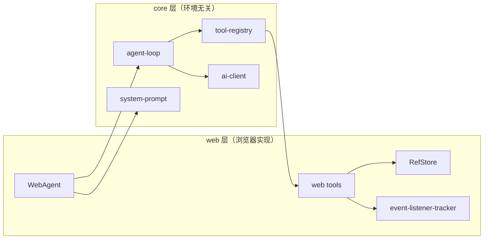
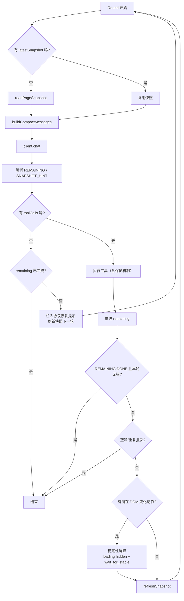

# AutoPilot 架构速读（工程师版）

> 这份文档不是“源码复读机”，而是帮助你在 10 分钟内建立正确心智模型。
> 如果你要改循环、快照、恢复机制，先看这份。

---

## 1. 先记住一句话

AutoPilot 的本质是一个**增量执行循环**：

- 看当前页面（快照）
- 决定这轮能做什么（工具调用）
- 执行并拿结果
- 刷新页面状态
- 继续吃掉剩余任务，直到 `REMAINING: DONE`

它不是“让 AI 一次性规划完整流程再执行”，而是**每轮只做当前可见、可执行的那一部分**。

---

## 2. 架构怎么分层（为什么这样分）

### 设计意图

- `core` 负责“怎么决策与收敛”，不碰 DOM
- `web` 负责“怎么操作页面”，可用浏览器 API
- 这样改 Prompt/Loop 不会污染 DOM 层，改工具实现也不影响协议层

---

## 3. 一次 `chat()` 里到底发生了什么

入口：`src/web/index.ts` 的 `WebAgent.chat()`

### 阶段 A：启动会话

1. 选择 AI Client（自定义优先，否则按 provider 创建）
2. 构建 system prompt（再拼接用户注册的 prompt 扩展）
3. 创建会话级 `RefStore`
4. 生成首轮快照（默认：`maxDepth=12, viewportOnly=false, maxNodes=500, maxChildren=30`）
5. 把快照包进 prompt，进入 Agent Loop

### 阶段 B：循环执行

交给 `executeAgentLoop()`，直到收敛或触发停机条件。

### 阶段 C：收尾

- memory 开启则保存 `result.messages`
- 清空会话 `RefStore`
- 返回 `reply/toolCalls/messages/metrics`

---

## 4. Agent Loop 的真实节奏（最重要）

### 你可以把每轮理解成：

- 输入：`current remaining + previous executed + latest snapshot`
- 输出：`this-round tool calls + new remaining`

关键状态：
- `remainingInstruction`：剩余任务文本
- `previousRoundTasks`：上一轮已执行任务
- `pendingNotFoundRetry`：not-found 重试上下文

---

## 5. 为什么它不容易“无限转圈”

因为有三层刹车：

1. **协议刹车**：要求模型输出 `REMAINING`，缺失时进入 protocol violation 修复轮
2. **行为刹车**：检测连续只读空转（`page_info.*` / `dom.get_text/get_attr`）
3. **批次刹车**：连续两轮完全同一计划批次（且无错）直接停机

额外兜底：`maxRounds=40`

---

## 6. 快照不是“辅助信息”，而是执行真相

快照策略在 `src/web/tools/page-info-tool.ts`。

### 当前快照语义（非常关键）

- 只给**交互节点**分配 `#hashID`
- 非交互节点只做上下文（标题、文本、容器）
- 标签可能是 role（角色优先）：
  - `[combobox]` 代替 `[input] role="combobox"`
  - `[slider]` 代替 `[div] role="slider"`
- 输出 `listeners="clk,inp,chg,..."` 作为运行时事件信号

### 这有什么价值

- 模型更容易选中“可操作目标”
- token 更省（不再给所有节点发 hash）
- 语义更接近实际交互模式（role > tag）

---

## 7. 默认参数真值表（按代码）

| 入口 | maxDepth | viewportOnly | maxNodes | maxChildren | maxTextLength |
| --- | ---: | ---: | ---: | ---: | ---: |
| `WebAgent.chat` 首轮快照 | 12 | false | 500 | 30 | 40 |
| `core readPageSnapshot` | 12 | false | 500 | 30 | 40 |
| `page_info.snapshot` 工具默认 | 12 | true | 220 | 25 | 40 |

---

## 8. 恢复机制怎么工作（出错不崩）

实现文件：`src/core/agent-loop/recovery.ts`

### 机制清单

1. 冗余 page_info 拦截：避免“只看不做”
2. 连续 snapshot 防抖：避免重复拍照
3. 元素未找到恢复：等待 + 刷新 + 限次
4. 导航后刷新：URL 变化后立刻更新快照
5. 空转检测：连续只读终止

### not-found 对话重试流

- 本轮收集失败任务（name/input/reason）
- 下一轮注入 `Not-found retry context` + `attempt x/y`
- 若仍找不到，按 `DEFAULT_NOT_FOUND_RETRY_WAIT_MS=1000` 等待后再试
- 超限后退出重试流，交给 remaining 协议收敛

---

## 9. 稳定性屏障（减少“页面还没稳就点”）

触发条件：本轮出现潜在 DOM 变化动作且无错误。

执行顺序固定：
1. `wait.wait_for_selector(state=hidden)`（loading 消失）
2. `wait.wait_for_stable`（DOM quiet）

默认值：
- `timeoutMs=4000`
- `quietMs=200`

`loadingSelectors` 语义：默认列表 + 用户列表**合并去重**（不是覆盖）。

---

## 10. 工程师改代码时最常犯的 4 个错误

1. 只改 loop 逻辑，不改 prompt/messages 语义
2. 改了默认参数，README/AGENTS/LOOP_MECHANISM 没同步
3. 在 `core` 里偷用 DOM API（破坏分层）
4. 遇到 not-found 直接加重试次数，而不是先查快照语义是否丢了目标

---

## 11. 快速排障地图

- **AI 重复做同一步**
  - 查：`previousRoundTasks` 是否正确注入
  - 查：`REMAINING` 是否缺失导致回退推进异常

- **模型一直在看页面不执行**
  - 查：`checkRedundantSnapshot` 是否生效
  - 查：是否触发 protocol violation 修复轮

- **点击后马上失败/误点**
  - 查：是否触发稳定性屏障
  - 查：`isPotentialDomMutation` 判定是否覆盖该动作

- **找不到元素但页面明明有**
  - 查：快照里是否有 `#hashID`
  - 查：该节点是否被判定成非交互（不分配 hash）
  - 查：是否应使用 role 标签（如 `[combobox]`）定位语义

---

## 12. 维护一致性要求

只要改动以下任一项，必须同步更新：

- `README.md`
- `AGENTS.md`
- `src/core/agent-loop/LOOP_MECHANISM.md`
- 本文（`docs/ARCHITECTURE_FLOW.md`）

涉及项：
- 轮次流程顺序
- REMAINING 协议与停机条件
- 恢复机制触发条件
- 快照语义（hash/role/listeners/默认值）

---

## 附：关键常量

| 常量 | 默认值 | 文件 |
| --- | ---: | --- |
| `DEFAULT_MAX_ROUNDS` | 40 | `src/core/agent-loop/constants.ts` |
| `DEFAULT_RECOVERY_WAIT_MS` | 100 | `src/core/agent-loop/constants.ts` |
| `DEFAULT_ACTION_RECOVERY_ROUNDS` | 2 | `src/core/agent-loop/constants.ts` |
| `DEFAULT_NOT_FOUND_RETRY_ROUNDS` | 2 | `src/core/agent-loop/constants.ts` |
| `DEFAULT_NOT_FOUND_RETRY_WAIT_MS` | 1000 | `src/core/agent-loop/constants.ts` |
| `DEFAULT_ROUND_STABILITY_WAIT_TIMEOUT_MS` | 4000 | `src/core/agent-loop/constants.ts` |
| `DEFAULT_ROUND_STABILITY_WAIT_QUIET_MS` | 200 | `src/core/agent-loop/constants.ts` |
| `wait-tool DEFAULT_TIMEOUT` | 6000 | `src/web/tools/wait-tool.ts` |
| `dom-tool DEFAULT_WAIT_MS` | 1200 | `src/web/tools/dom-tool.ts` |
